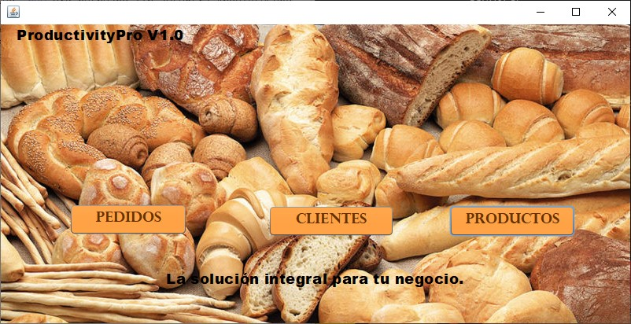
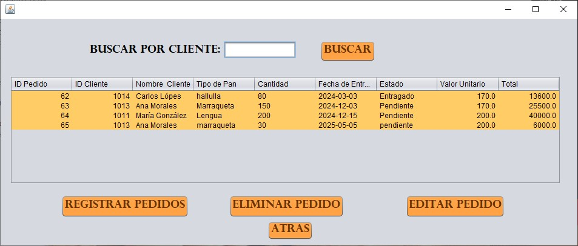
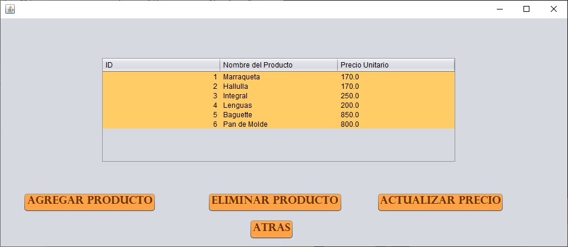

# 🥖 Sistema de Gestión de Ventas de Panadería

Este proyecto fue desarrollado como parte de una asignatura de Java durante mi formación como estudiante de Ingeniería Informática. 
El objetivo fue aplicar los conocimientos adquiridos para resolver una necesidad real en mi empleo actual: gestionar pedidos, productos y clientes dentro de una panadería.

---

## 📌 Descripción

**Panadería App** es una aplicación de escritorio construida con Java y Swing que permite registrar ventas, calcular ingresos diarios y mantener el control de pedidos y productos desde una interfaz amigable.

---

## 💻 Tecnologías utilizadas

- ☕ Java SE (JDK 8+)
- 🧰 NetBeans 23
- 🖼️ Swing (GUI)
- 📦 AbsoluteLayout
- 🐬 MySQL (opcional)
- 🔗 JDBC

---

## ✨ Funcionalidades principales

- Registro y gestión de clientes
- Registro de productos y pedidos
- Cálculo de ingresos diarios
- Interfaz gráfica amigable con botones e imagen personalizada
- Navegación fluida entre ventanas
- Posible integración con base de datos (extensible)

---

## 🖼️ Capturas de Pantalla

### 🏠 Pantalla de inicio


### 📋 Gestión de pedidos


### 👥 Gestión de clientes


### 🍞 Gestión de productos



---

## 🛠️ Cómo ejecutar el proyecto

1. Clona el repositorio:
   ```bash
   git clone https://github.com/Bryckson/Panaderia.git
---

## 🗄️ Base de Datos (MySQL)

Este proyecto usa una base de datos llamada `distribuidora_pedidos`.

### Restaurar la base de datos:

1. Abre [phpMyAdmin](http://localhost/phpmyadmin/) (incluido con XAMPP).
2. Crea una base de datos nueva llamada `distribuidora_pedidos`.
3. Importa el archivo `distribuidora_pedidos.sql` que se incluye en este repositorio.
4. Verifica que las tablas `clientes`, `pedidos` y `productos` hayan sido creadas correctamente.

---

## 🔌 Conexión a MySQL desde Java

### Requisitos:

- Java JDK 8 o superior.
- NetBeans IDE (recomendado: 23).
- Conector JDBC de MySQL:  
  📦 [Descargar mysql-connector-j-9.1.0.jar](https://dev.mysql.com/downloads/connector/j/)

### Cómo agregar el conector en NetBeans:

1. Haz clic derecho en tu proyecto → `Properties`.
2. Ve a `Libraries`.
3. Clic en **"Add JAR/Folder"**.
4. Selecciona el archivo `mysql-connector-j-9.1.0.jar`.
5. Aplica los cambios y compila nuevamente el proyecto.

---


